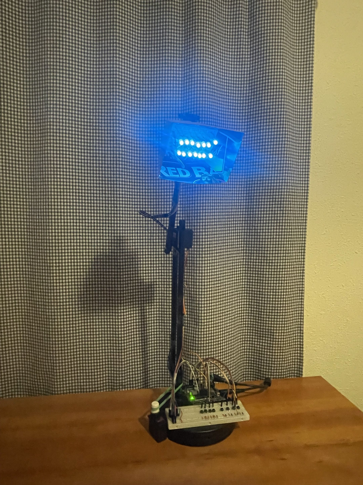

# Arduino-Smart-Lamp
This is a RGB lamp built using an Arduino board. It can be toggled to display different colors, or to cycle through them automatically. It rotates on two axes using servo motors.  
**Pictures:**   
 
  
